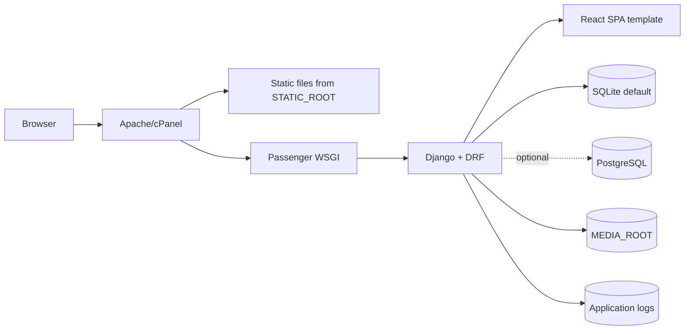

# Architecture Diagram

```mermaid
flowchart LR
    User[Browser] --> Apache[Apache/cPanel]
    Apache --> Static[Static files from STATIC_ROOT]
    Apache --> Passenger[Passenger WSGI]
    Passenger --> Django[Django + DRF]
    Django --> Frontend[React SPA template]
    Django --> SQLite[(SQLite default)]
    Django -. optional .-> Postgres[(PostgreSQL)]
    Django --> Media[(MEDIA_ROOT)]
    Django --> Logs[(Application logs)]
```
