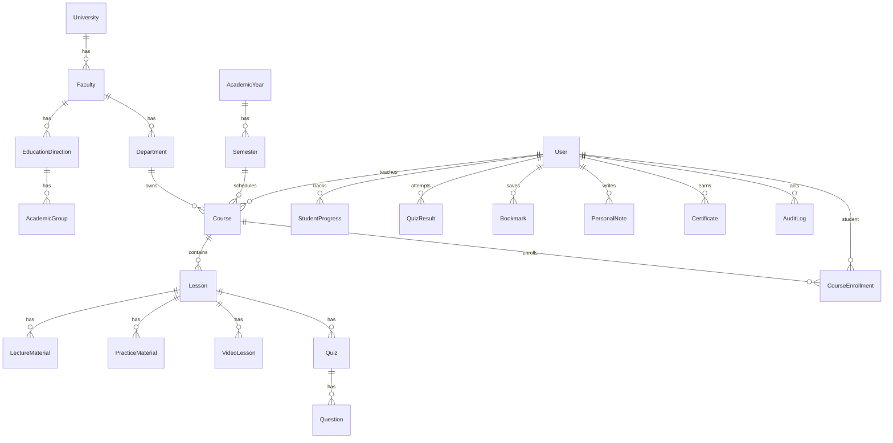

# ER Diagram

```mermaid
erDiagram
    University ||--o{ Faculty : has
    Faculty ||--o{ Department : has
    Faculty ||--o{ EducationDirection : has
    EducationDirection ||--o{ AcademicGroup : has
    AcademicYear ||--o{ Semester : has
    Department ||--o{ Course : owns
    Semester ||--o{ Course : schedules
    User ||--o{ Course : teaches
    Course ||--o{ Lesson : contains
    Course ||--o{ CourseEnrollment : enrolls
    User ||--o{ CourseEnrollment : student
    Lesson ||--o{ LectureMaterial : has
    Lesson ||--o{ PracticeMaterial : has
    Lesson ||--o{ VideoLesson : has
    Lesson ||--o{ Quiz : has
    Quiz ||--o{ Question : has
    User ||--o{ StudentProgress : tracks
    User ||--o{ QuizResult : attempts
    User ||--o{ Bookmark : saves
    User ||--o{ PersonalNote : writes
    User ||--o{ Certificate : earns
    User ||--o{ AuditLog : acts
```
